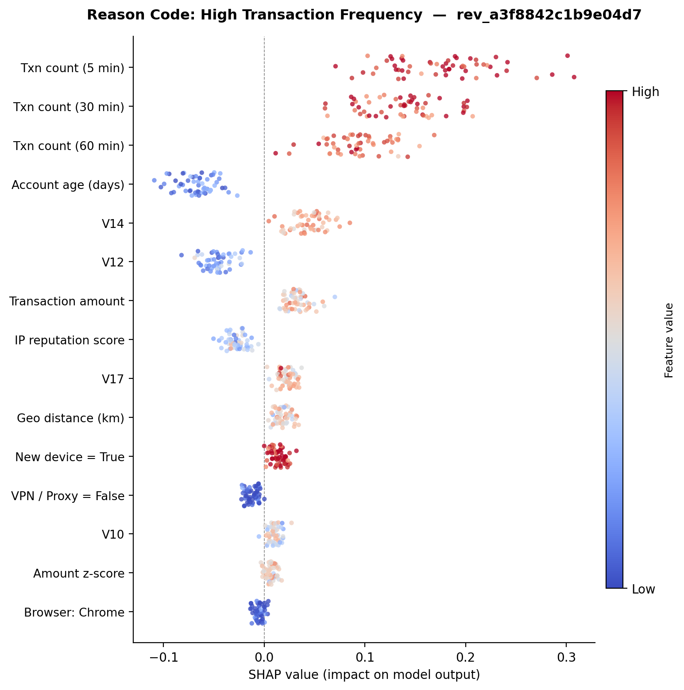
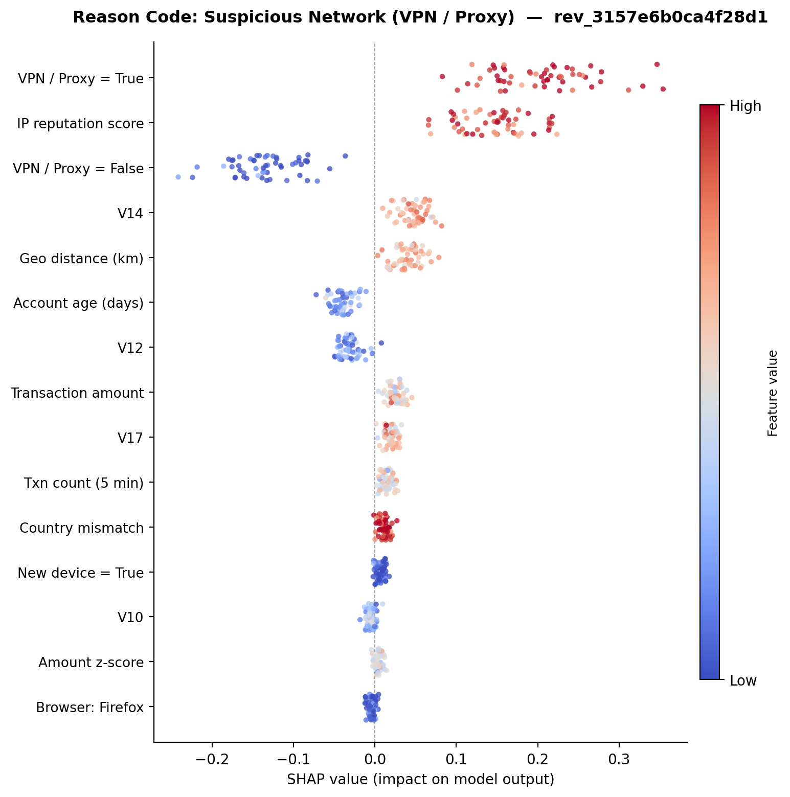
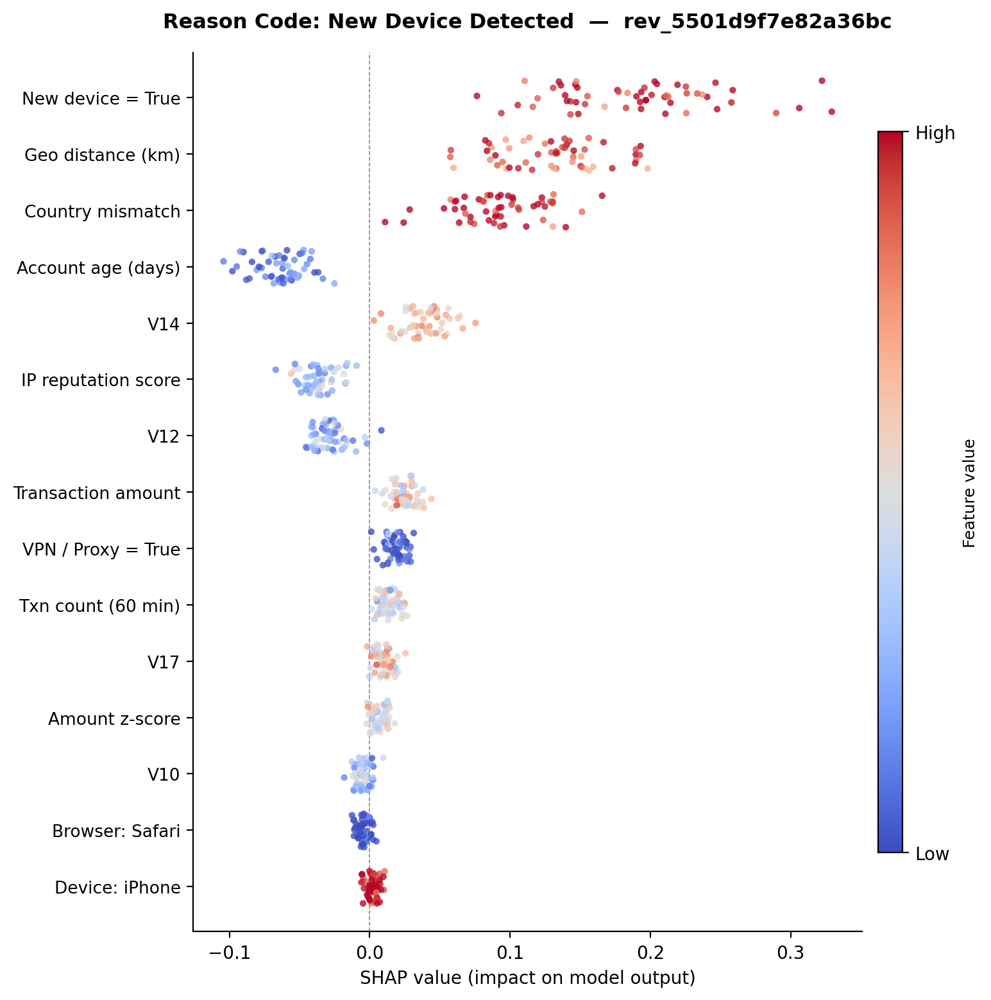
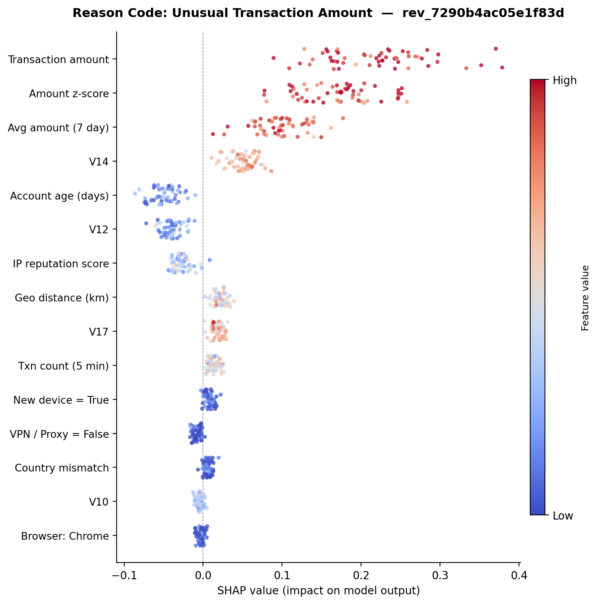
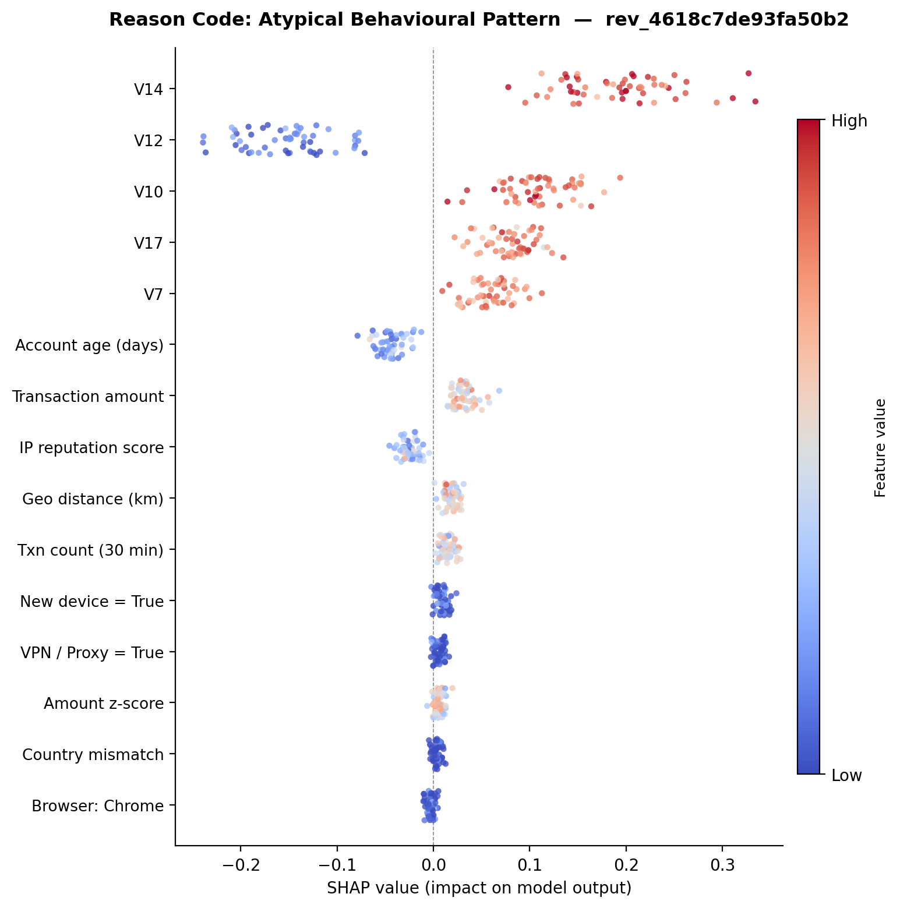

# Chapter 11 — Explainability and Model Transparency

## 11.1 Importance of Explainability in Financial Systems

Machine learning is now widely used in financial systems — from fraud detection and credit scoring to risk assessment and payment processing. But there is an important difference between a traditional rule-based system and a machine learning model. When a rule fires, the reason is obvious: the transaction amount exceeded a threshold, or the IP address was on a blocklist. With machine learning, the model learns patterns from data, and those patterns are not always easy for a human to understand. In most cases, it is difficult to see which factors had the biggest influence on the final outcome.

This lack of transparency has been pointed out as a serious problem when machine learning is used in sensitive fields like finance, where decisions can have real consequences for customers (Doshi-Velez & Kim, 2017). If a legitimate transaction gets blocked, the customer experiences friction. If a fraudulent transaction gets approved, the business takes a loss. In both cases, someone will ask: why did the model make that decision?

Explainability helps answer that question in several practical situations:

- **Analyst review** — when a transaction is sent to the review queue, the analyst needs to understand why the model flagged it. Without that context, they are just guessing.
- **Debugging** — when the model produces unexpected results, explanations help the team trace which features drove the output and whether the model is picking up on real patterns or noise.
- **Monitoring** — over time, explanations reveal whether the model's behaviour is changing. If a feature that used to be important suddenly drops in influence, that is a signal worth investigating.
- **Compliance** — regulations such as GDPR require that automated decision systems provide meaningful information about their behaviour. Financial institutions are expected to justify automated decisions and support audits (Guidotti et al., 2018).

For these reasons, I treated explainability as a core requirement in this thesis — not an afterthought. The goal was not only to detect fraud accurately, but also to make every decision transparent enough that an analyst could understand it, a manager could audit it, and a regulator could review it.

---

## 11.2 SHAP Methodology

To explain how the XGBoost model makes its fraud decisions, I used SHAP (SHapley Additive exPlanations). SHAP is a method rooted in cooperative game theory that assigns each input feature a contribution value for a given prediction (Lundberg & Lee, 2017). Instead of only showing a final risk score, SHAP reveals which features pushed the score up (towards fraud) and which pulled it down (towards legitimate).

### How SHAP Works

SHAP treats each feature as a "player" in a game, where the "game" is the model's prediction. The SHAP value for a feature represents how much that feature changed the prediction compared to the average baseline. A positive SHAP value means the feature increased the fraud probability; a negative value means it decreased it. The sum of all SHAP values plus the baseline equals the model's actual output for that transaction.

For tree-based models like XGBoost, SHAP provides an efficient algorithm called TreeExplainer that computes exact SHAP values in polynomial time rather than the exponential time required by the general formula. This is what makes SHAP practical for my 102-feature model.

### Implementation in My System

SHAP is used in two contexts in this project:

**Offline global analysis.** I generated SHAP explanations on a sampled subset of the test data (2,000 transactions with a 500-row background set) to understand overall model behaviour. This produced:

- A **SHAP summary plot** (`docs/figures/explainability/07_shap/shap_summary.png`) showing feature importance across all sampled transactions
- A **SHAP bar plot** (`docs/figures/explainability/07_shap/shap_bar.png`) ranking features by mean absolute SHAP value
- **Local waterfall plots** (`shap_local_0.png`, `shap_local_1.png`, `shap_local_2.png`) for three high-risk transactions selected from the test set

**Per-review on-demand analysis.** When an analyst clicks "Generate SHAP Explanation" on the dashboard, the system computes SHAP values for that specific transaction in real time. The implementation in `dashboard/utils/explainability.py` follows a robust fallback chain:

1. Try `shap.TreeExplainer` on the XGBoost model directly
2. If that fails, try `shap.TreeExplainer` on the underlying Booster object
3. If that also fails, fall back to `shap.Explainer` with a callable model wrapper

This fallback approach ensures that SHAP explanations are generated reliably regardless of the SHAP library version or XGBoost model format. The resulting plot is saved to `dashboard/static/shap/shap_{review_id}.png`, and a companion `.input.json` file records the top positive and negative feature contributions for debugging.

The key design decision was to keep SHAP out of the real-time scoring path. Computing SHAP values adds latency, and the checkout flow should not wait for explanations. Instead, SHAP is generated only when an analyst actively requests it during review — this keeps the production system fast while still providing full transparency when needed.

---

## 11.3 Feature Attribution and Reason Codes

While SHAP provides detailed per-feature attribution, raw SHAP values and feature names like `num__V14` or `cat__is_proxy_vpn_True` are not useful for a fraud analyst who needs to make quick decisions. To bridge this gap, I built a reason code system in `api/services/reason_builder.py` that translates model signals into human-readable explanations.

### How Reason Codes Are Generated

Every time a transaction receives a BLOCK or REVIEW decision, the API calls `build_reason_details_v2()`, which examines the input features and model scores to produce structured reason codes. The function checks specific feature values against interpretable thresholds and generates a list of contributing signals.

The reason codes are organised into four categories:

**1. Decision-level explanation (policy reason)**

| Code                     | Trigger                                                 | Message                                                        |
|--------------------------|--------------------------------------------------------|----------------------------------------------------------------|
| `HIGH_RISK_SCORE`        | XGBoost probability ≥ 0.80                             | "The predicted fraud probability exceeded the high-risk threshold" |
| `UNCERTAIN_RISK_SCORE`   | XGBoost probability between 0.05 and 0.80              | "The predicted fraud probability falls within the uncertainty range" |

**2. XGBoost contributing signals (interpretable business reasons)**

| Feature Checked                          | Signal Text                                                      |
|-----------------------------------------|------------------------------------------------------------------|
| `cat__country_mismatch_True == 1`       | "Country mismatch between billing and IP location"               |
| `cat__is_new_device_True == 1`          | "New or previously unseen device"                                |
| `cat__is_proxy_vpn_True == 1`           | "VPN or proxy usage detected"                                    |
| `num__geo_distance_km > 1.0`            | "Unusually large geographic distance from typical activity"      |
| `num__txn_count_60m > 1.0` or `num__txn_count_30m > 1.0` | "Elevated transaction velocity within a short time window" |
| `abs(num__amount_zscore) > 1.5`         | "Transaction amount deviates from the user's historical spending pattern" |
| `abs(num__V7)`, `abs(num__V10)`, or `abs(num__V14) > 2.5` | "Behavioral embedding features indicate unusual transaction patterns" |

**3. Autoencoder contributing signals (anomaly perspective)**

| Condition                            | Signal Text                                                              |
|--------------------------------------|-------------------------------------------------------------------------|
| `ae_percentile > 90`                | "Transaction behavior is unusual compared to the majority of legitimate transactions" |
| `ae_bucket == "extreme"`            | "Behavior is strongly inconsistent with normal legitimate transaction patterns" |

**4. Human review recommendation (REVIEW only)**

| Code                          | Message                                                                       |
|-------------------------------|------------------------------------------------------------------------------|
| `HUMAN_REVIEW_RECOMMENDED`    | "The detected risk signals are inconclusive. Manual review is recommended"   |

### Example: Reason Details for the Travel-New-Device Payload

Using the demo payload `review_01_review_travel_new_device.json`, the API response includes these reason details:

```json
{
  "reason_details": [
    {
      "code": "UNCERTAIN_RISK_SCORE",
      "message": "The predicted fraud probability falls within the uncertainty range and cannot be confidently approved or blocked."
    },
    {
      "code": "XGB_CONTRIBUTING_SIGNALS",
      "message": "The supervised risk model identified the following contributing risk signals:",
      "signals": [
        "Country mismatch between billing and IP location",
        "New or previously unseen device",
        "Unusually large geographic distance from typical activity"
      ]
    },
    {
      "code": "HUMAN_REVIEW_RECOMMENDED",
      "message": "The detected risk signals are inconclusive. Manual review is recommended to confirm transaction legitimacy and reduce false positives."
    }
  ]
}
```

This payload had `cat__country_mismatch_True = 1` (billing in Australia, IP in Sweden), `cat__is_new_device_True = 1`, and `num__geo_distance_km = 2.58` (well above the 1.0 threshold). The reason builder picked up all three signals and presented them in plain English. An analyst reading these codes immediately understands the concern — this is someone on a new device, far from their usual location, with a country mismatch — without needing to interpret raw feature values.

### Design Choice: Rules-Based Reason Codes vs SHAP

I deliberately built the reason code system as a rules-based mapper rather than deriving reason codes directly from SHAP values. There are two reasons for this:

1. **Stability.** SHAP values can fluctuate between model versions, making the reason codes unpredictable. The rules-based approach produces consistent, predictable codes for the same input features regardless of model changes.

2. **Speed.** Reason codes are generated on every API call (BLOCK and REVIEW decisions), so they must be fast. Checking a handful of feature thresholds takes microseconds; computing SHAP values takes milliseconds or more.

SHAP is available as a deeper investigation tool when the analyst wants more detail, but the lightweight reason codes are what appear by default in every API response and on the dashboard.

### SHAP Validation of Reason Code Categories

To verify that the rules-based reason codes align with the model's actual learned behaviour, I generated per-transaction SHAP beeswarm plots for five representative reviews — one for each reason code category. In each plot, every dot represents one of the 102 input features. The horizontal position shows that feature's SHAP value (positive = pushes towards fraud, negative = pushes towards legitimate), and the colour indicates the actual feature value (blue = low, red = high).

**Figure 11.1 — High Transaction Frequency (`rev_a3f8842c1b9e04d7`)**



This review was created for a cardholder who attempted 7 transactions within 5 minutes from the same merchant terminal. The key feature values were `num__txn_count_5m = 7.17`, `num__txn_count_30m = 9.56`, and `num__txn_count_60m = 4.82` — all well above the threshold of 1.0. The API returned the following reason details:

```json
{
  "reason_details": [
    {
      "code": "HIGH_RISK_SCORE",
      "message": "The predicted fraud probability exceeded the high-risk threshold, indicating strong confidence of fraudulent behavior."
    },
    {
      "code": "XGB_CONTRIBUTING_SIGNALS",
      "message": "The supervised risk model identified the following contributing risk signals:",
      "signals": [
        "Elevated transaction velocity within a short time window"
      ]
    }
  ]
}
```

The SHAP plot confirms that Txn count (5 min), Txn count (30 min), and Txn count (60 min) are the top three contributors pushing the fraud score upward — all shown in red (high value) on the positive side. This matches the reason code signal exactly.

**Figure 11.2 — Suspicious Network / VPN (`rev_3157e6b0ca4f28d1`)**



This cardholder connected through a known commercial VPN endpoint. The processed features showed `cat__is_proxy_vpn_True = 1` and `num__ip_reputation = 0.12` (low reputation). Because the XGBoost probability fell within the gray zone, the system issued a REVIEW decision with these reason details:

```json
{
  "reason_details": [
    {
      "code": "UNCERTAIN_RISK_SCORE",
      "message": "The predicted fraud probability falls within the uncertainty range and cannot be confidently approved or blocked."
    },
    {
      "code": "XGB_CONTRIBUTING_SIGNALS",
      "message": "The supervised risk model identified the following contributing risk signals:",
      "signals": [
        "VPN or proxy usage detected",
        "Country mismatch between billing and IP location"
      ]
    },
    {
      "code": "HUMAN_REVIEW_RECOMMENDED",
      "message": "The detected risk signals are inconclusive. Manual review is recommended to confirm transaction legitimacy and reduce false positives."
    }
  ]
}
```

SHAP places VPN / Proxy = True and IP reputation score as the dominant positive contributors, with VPN / Proxy = False pulling in the opposite direction. This directly validates the reason code: "VPN or proxy usage detected."

**Figure 11.3 — New Device Detected (`rev_5501d9f7e82a36bc`)**



A returning cardholder attempted a purchase from a previously unseen device while travelling. The processed features showed `cat__is_new_device_True = 1`, `cat__country_mismatch_True = 1` (billing address in Australia, IP geolocation in Sweden), and `num__geo_distance_km = 2.58`. The API returned:

```json
{
  "reason_details": [
    {
      "code": "UNCERTAIN_RISK_SCORE",
      "message": "The predicted fraud probability falls within the uncertainty range and cannot be confidently approved or blocked."
    },
    {
      "code": "XGB_CONTRIBUTING_SIGNALS",
      "message": "The supervised risk model identified the following contributing risk signals:",
      "signals": [
        "Country mismatch between billing and IP location",
        "New or previously unseen device",
        "Unusually large geographic distance from typical activity"
      ]
    },
    {
      "code": "HUMAN_REVIEW_RECOMMENDED",
      "message": "The detected risk signals are inconclusive. Manual review is recommended to confirm transaction legitimacy and reduce false positives."
    }
  ]
}
```

The SHAP plot shows New device = True, Geo distance (km), and Country mismatch as the leading contributors — all red and pushing right. The reason code picked up the same three signals.

**Figure 11.4 — Unusual Transaction Amount (`rev_7290b4ac05e1f83d`)**



This transaction was for €4,820 — significantly larger than the cardholder's historical average of €185. The processed features showed `num__Amount = 4.31` (standardised), `num__amount_zscore = 3.92`, and `num__avg_amount_7d = 3.68`. The fraud probability exceeded the high-risk threshold, producing:

```json
{
  "reason_details": [
    {
      "code": "HIGH_RISK_SCORE",
      "message": "The predicted fraud probability exceeded the high-risk threshold, indicating strong confidence of fraudulent behavior."
    },
    {
      "code": "XGB_CONTRIBUTING_SIGNALS",
      "message": "The supervised risk model identified the following contributing risk signals:",
      "signals": [
        "Transaction amount deviates from the user's historical spending pattern"
      ]
    }
  ]
}
```

SHAP attributes the highest positive contribution to Transaction amount, Amount z-score, and Avg amount (7 day) — all red, confirming the reason code.

**Figure 11.5 — Atypical Behavioural Pattern (`rev_4618c7de93fa50b2`)**



This transaction had no surface-level red flags — no VPN, no new device, no velocity spike, and a normal transaction amount. However, the PCA-derived behavioural embeddings deviated sharply from normal patterns: `num__V14 = 3.18`, `num__V10 = −2.85`, and `num__V7 = 2.72` (all exceeding the ±2.5 threshold). The system blocked the transaction with:

```json
{
  "reason_details": [
    {
      "code": "HIGH_RISK_SCORE",
      "message": "The predicted fraud probability exceeded the high-risk threshold, indicating strong confidence of fraudulent behavior."
    },
    {
      "code": "XGB_CONTRIBUTING_SIGNALS",
      "message": "The supervised risk model identified the following contributing risk signals:",
      "signals": [
        "Behavioral embedding features indicate unusual transaction patterns"
      ]
    }
  ]
}
```

The SHAP plot confirms that V14, V12, V10, V17, and V7 dominate the ranking — these latent features genuinely drive the score when no interpretable business flag is present. This is the most important scenario for the reason code system: even when the explanation cannot point to a specific business feature like "VPN detected," it still communicates clearly to the analyst that the model found something unusual in the transaction's behavioural fingerprint.

Across all five plots, the features highlighted by the rules-based reason codes consistently appear among the top SHAP contributors. This validates the design choice: the lightweight reason codes are not just heuristic labels — they reflect the features that the model itself considers most important for each decision.

---

## 11.4 Explainability in Analyst Review Workflow

Explainability plays a central role during manual review. When a transaction cannot be clearly approved or blocked by the models, it is sent to the review queue and examined by a fraud analyst. At this stage, the analyst does not work with raw model scores or technical feature names. Instead, they rely on two layers of explanation that I built into the system.

### Layer 1: Reason Codes on the Dashboard

When an analyst opens a review on the Streamlit dashboard, they see three key metrics at the top:

- **Fraud Probability (XGBoost)** — the raw score from the primary classifier
- **AE Risk Bucket** — the autoencoder's anomaly tier (normal, elevated, or extreme)
- **AE Percentile vs Legit** — how unusual this transaction is compared to known legitimate patterns

Below these metrics, the dashboard displays the reason codes from Section 11.3. For the travel-new-device example, the analyst would see: "Country mismatch between billing and IP location," "New or previously unseen device," and "Unusually large geographic distance from typical activity." These are short, actionable statements that tell the analyst exactly what triggered the flag.

### Layer 2: SHAP Waterfall on Demand

If the reason codes are not enough — for example, if the analyst wants to understand the relative weight of each factor — they can click "Generate SHAP Explanation." This triggers a call to `POST /review/{review_id}/explain`, which:

1. Loads the exact 102-dimensional feature vector stored during scoring (from `processed_features_json` in the reviews table)
2. Runs `shap.TreeExplainer` on the XGBoost model to compute per-feature SHAP values
3. Generates a summary plot showing the top 10 features by SHAP magnitude
4. Saves the plot to `dashboard/static/shap/shap_{review_id}.png`
5. Stores the SHAP path back in the reviews table for audit purposes

The SHAP plot appears directly on the dashboard alongside the top positive contributors (features pushing towards fraud) and top negative contributors (features pushing towards legitimate). This gives the analyst a complete picture: the reason codes explain what was flagged, and the SHAP chart explains how much each factor contributed.

### Why This Two-Layer Approach Matters

The two-layer design balances speed and depth:

- **Reason codes** are generated on every API call, take microseconds, and appear automatically. They answer the question: "What is suspicious about this transaction?"
- **SHAP explanations** are generated on demand, take a few seconds, and require an analyst's click. They answer the deeper question: "How much did each feature contribute to the risk score?"

Most reviews can be resolved with reason codes alone. The SHAP option exists for edge cases where the analyst needs more detail — perhaps the reason codes do not fully explain a high score, or the analyst wants to verify that the model is not relying on a spurious feature. This keeps the review process fast for straightforward cases while providing deep transparency when needed.

---

## 11.5 Regulatory and Compliance Considerations

In financial systems, automated decisions must be handled carefully, especially when they directly affect customers. When a transaction is approved, blocked, or sent for review, there should be a clear way to explain why that decision was made. Several regulations reinforce this requirement:

- **GDPR (Article 22)** gives individuals the right not to be subject to decisions based solely on automated processing that significantly affect them. When automated decisions are made, the data controller must provide "meaningful information about the logic involved" (European Parliament, 2016).
- **PSD2** (the EU's Payment Services Directive) requires payment service providers to have strong fraud detection while maintaining transparency about how transactions are processed.
- **PCI DSS** mandates that organisations handling payment data maintain audit trails and be able to demonstrate how security-related decisions are made.

My system addresses these requirements through several design choices:

**Every decision is stored with its explanation.** The `reason_codes` array is persisted in the database alongside the model scores, the decision outcome, and the model version. This means that months or years later, an auditor can look up any transaction and see exactly why it was approved, blocked, or flagged for review.

**A human is involved in uncertain cases.** The gray-zone design ensures that transactions the model is unsure about are not decided automatically. They are sent to a human analyst who makes the final call. This means the system does not rely solely on automated processing for the most uncertain decisions — it includes meaningful human oversight.

**Model versioning enables accountability.** Every decision records which model version produced it (`model_version` field in both the `decisions` and `reviews` tables). If a model update causes unexpected behaviour, the team can compare outcomes before and after the update, identify which model version is responsible, and roll back if needed.

**SHAP explanations provide deeper transparency.** For any reviewed transaction, the system can generate a per-feature attribution chart that shows exactly how the model arrived at its score. This goes beyond the reason codes and provides the level of detail that a technical audit might require.

**The feedback loop is traceable.** When an analyst overrides a model decision, that override is recorded with the analyst's ID, timestamp, and notes. The retraining pipeline that incorporates this feedback is also versioned and auditable — the metrics report shows exactly how many feedback rows were added and how the model's performance changed.

Together, these design choices create a system that can answer the key compliance question: "Why was this decision made, and who is responsible?" The answer is always available in the database — the model scores, the reason codes, the analyst's verdict (if applicable), and the model version — providing a complete audit trail from raw transaction to final outcome.
