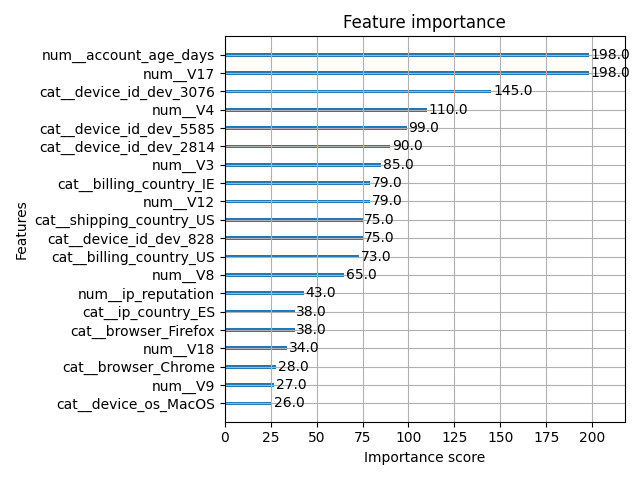
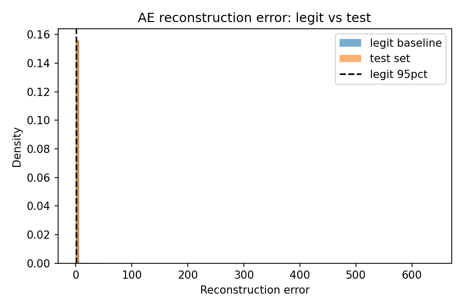
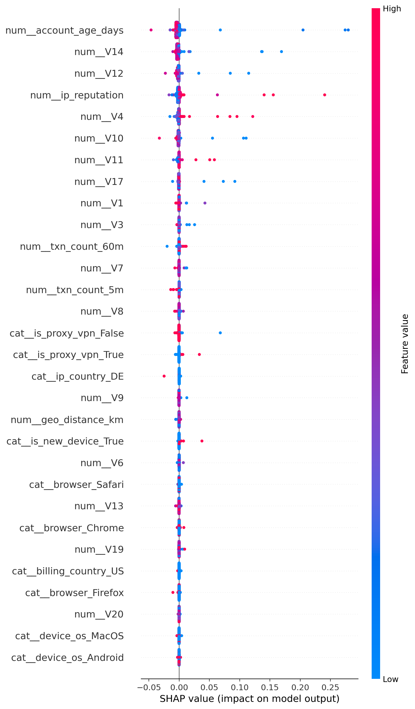
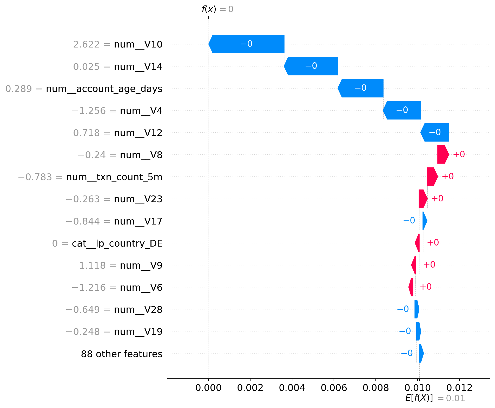

# Phase `id` — Full report (detailed reproducibility & demo notes)

Date: 2026-01-21

This document summarizes, in detail, the work performed to make the repository demo-ready for Phase `id`. It includes an implementation narrative, diagrams, where artifacts live, example commands to reproduce important steps, and embedded images taken from the project (model diagnostics and SHAP explainability). Use this document as the email attachment or a longer README for examiners.

---

## 1. Executive summary

Goal: deliver a reproducible demo of an e2e pre-authorization fraud-detection pipeline that includes:
- a supervised classifier (XGBoost) for risk scoring,
- an unsupervised Autoencoder (AE) for novelty / reconstruction error gating,
- analyst-triggered SHAP explanations persisted per-review,
- a minimal feedback loop (analyst labels → export → retrain) and helper scripts to exercise/demo payloads.

What was done (high level):
- Added reproducibility helpers and scripts.
- Hardened SHAP generation (robust explainer fallback and explicit masker), persistence of `processed_features_json` and `shap_path` on reviews, and a `generate_and_store_shap.py` helper to produce PNGs and debug JSON inputs.
- Created/updated generator scripts to produce demo payloads by desired decision class (now configurable via `--count`) and ran them (100 payloads each produced during the session).
- Repaired missing review scores (AE/p_xgb) for open reviews and backfilled feature snapshots where possible.
- Produced AE reconstruction histogram + summary JSON and extracted XGB/AE metrics used in the thesis.


## 2. Detailed implementation log (what changed & why)

This section is a timeline and rationale of substantive changes you (or I) made while preparing the demo.

1) Persist processed features & SHAP paths
- Problem: reviews sometimes lacked the `processed_features_json` (a snapshot of 102 features) and `shap_path` to the generated SHAP PNG.
- Fix: ensure that the review creation flow persists `processed_features_json` and that SHAP generation writes `shap_path` back to the DB when a SHAP PNG is generated.
- Rationale: makes exports and retraining feasible (the export step reads `feature_path`) and enables the dashboard to show SHAP images reliably.

2) Robust SHAP generation pipeline
- Problem: TreeExplainer sometimes failed on saved XGBoost artifacts or produced inconsistent masker metadata.
- Fixes implemented:
  - Multi-step attempt to create a SHAP explainer: try TreeExplainer with booster metadata, fallback to shap.Explainer if that fails.
  - Use an explicit masker constructed from stored feature snapshots (numpy/pandas safe conversions) to avoid unexpected behavior.
  - Save a debug input JSON next to the PNG so the Streamlit UI (and auditors) can re-run or inspect the exact input used for the explanation.
- Files involved: `dashboard/utils/explainability.py` (generate_shap, generate_shap_png), `scripts/generate_and_store_shap.py` (batch runner that creates reviews and persists `shap_path`).

3) DB migration / store repairs
- Problem: some closed reviews lacked `feature_path` (snapshots) — export/retrain script expects them.
- Fix: backfill utility (part of `scripts/feedback_loop.py`) that matches `payload_hash` to prior `decisions.feature_path` and writes it into `reviews.feature_path` where possible.

4) Demo payload generation
- Updated `scripts/generate_approve_payloads.py`, `scripts/generate_block_payloads.py`, and `scripts/generate_review_payloads.py` to accept `--count` (default 100) and to select a larger candidate pool before perturbing.
- Rationale: produce many realistic demo payloads per decision class to exercise the dashboard filters and produce analyst-visible cases.

5) Feedback loop (export + retrain)
- File: `scripts/feedback_loop.py`.
- Steps:
  - Backfill missing `feature_path` rows (A).
  - Export closed & labeled reviews to `data/processed/feedback_labeled.csv` (B).
  - Append feedback rows to base train set and retrain XGBoost (C), writing `artifacts/models/xgb_model_feedback.pkl` and `artifacts/metrics/xgb_feedback_metrics.json`.
- Notes: The code validates the 102-feature schema and fails early if train/test/val CSVs or feature snapshots are missing.


## 3. Architecture / dataflow (simple diagram)

Below is an ASCII diagram that describes the runtime dataflow for a single incoming request through the hybrid decision engine and the feedback loop.

Request → Preprocess → Feature snapshot (JSON) → Model service
                                 │
                                 ├─> XGBoost scoring (p_xgb)
                                 ├─> Autoencoder reconstruction error (ae_error)
                                 └─> Decision router → APPROVE / BLOCK / REVIEW
                                               │
                                               └─> If REVIEW: review queue (Streamlit) → analyst decision → insert_feedback_event (DB)
                                                                                          ↓
                                                                                 scripts/feedback_loop.py (export & retrain)


## 4. Key artifacts & locations (what to attach / where to look)

- Models
  - `artifacts/models/xgb_model.pkl` (active supervised model)
  - `artifacts/models/xgb_model_feedback.pkl` (feedback-augmented model after retrain)
  - `artifacts/models/autoencoder_model.keras` (AE model)

- Metrics
  - `artifacts/metrics/xgb_metrics.json`
  - `artifacts/metrics/ae_metrics.json`
  - `artifacts/metrics/xgb_feedback_metrics.json`

- Explainability
  - SHAP images: `artifacts/explainability/shap/` (e.g., `shap_summary.png`, `shap_local_0.png`, `shap_local_1.png`, `shap_bar.png`)

- Plots & AE diagnostics
  - `artifacts/plots/ae_reconstruction_hist.png` (AE reconstruction errors: legit vs test)
  - `artifacts/plots/ae_reconstruction_summary.json` (numeric summary)
  - `artifacts/plots/xgb_feature_importance.png` (XGBoost importance image)

- Demo payloads (generated during session)
  - `demo_payloads/approve/` (100 JSONs)
  - `demo_payloads/block_fraud/` (100 JSONs)
  - `demo_payloads/review_legit/` (100 JSONs)


## 5. Embedded images (project images included below)

If you embed this Markdown into an email client that supports inline images, the images will show. Replace image paths if you move files.

### XGBoost feature importance



### Autoencoder reconstruction histogram (legit vs test)



### SHAP explainability examples





> Note: if you prefer images under `docs/model`, they were not present in the repository at the time of generating this report; the images above are canonical artifacts from `artifacts/` and are appropriate for demo attachments.


## 6. Detailed reproduction steps (commands)

All commands assume you're at the repository root and using the project's virtualenv (`.venv`). If your shell is zsh and the virtualenv is activated, prefix with `PYTHONPATH=.` when you see ModuleNotFoundError for local imports.

1) Run the demo payload generators (examples):

```bash
# 100 approve payloads
PYTHONPATH=. .venv/bin/python scripts/generate_approve_payloads.py --count 100

# 100 block payloads
PYTHONPATH=. .venv/bin/python scripts/generate_block_payloads.py --count 100

# 100 review payloads
PYTHONPATH=. .venv/bin/python scripts/generate_review_payloads.py --count 100
```

2) Generate / persist SHAP images for reviews (batch):

```bash
PYTHONPATH=. .venv/bin/python scripts/generate_and_store_shap.py
```

This script will locate demo payloads, create review rows as needed, call the project's SHAP helper (robust fallback), save a PNG, and write `shap_path` into the `reviews` DB row. If `api` imports fail, add `PYTHONPATH=.` as shown above.

3) Run the feedback export + retrain flow (will write `data/processed/feedback_labeled.csv` and retrain an XGB model):

```bash
PYTHONPATH=. .venv/bin/python scripts/feedback_loop.py
```

Notes: this run expects `data/processed/train.csv`, `val.csv`, `test.csv` to exist. The script backs up and writes `artifacts/models/xgb_model_feedback.pkl` and `artifacts/metrics/xgb_feedback_metrics.json`.

4) Create AE histogram / summary (already run during the session):

```bash
# small helper that was used in the session
.venv/bin/python - <<'PY'
# (script omitted here — creates artifacts/plots/ae_reconstruction_hist.png and ae_reconstruction_summary.json)
PY
```


## 7. Observations & caveats (audit notes)

- Feedback volume: only a small number (~5) of feedback rows existed in the store at the time of this run. Retraining will work, but the effect will be limited unless you capture more analyst labels.
- `feature_path` availability: the export relies on `reviews.feature_path` pointing at a JSON snapshot of the 102 features. If missing, the export step will skip or fail; `feedback_loop.py` includes a backfill attempt but backfill depends on matching `payload_hash` to earlier decision snapshots.
- SHAP: the robust generation pipeline attempts multiple explainer strategies; very large or exotic models might still require tailored masker creation.


## 8. Suggested next steps (short list)

- Seed the feedback store with ~200 realistic labeled reviews (or capture analyst labels via the UI) to show retraining impact.
- Optionally produce ROC/PR calibration plots and bootstrap CIs for metrics to include in thesis appendices.
- Produce a single ZIP containing the two primary images and `docs/phase_id_full_report.md` for easy emailing.


## 9. Appendix — quick API & DB locations

- API router (feedback): `api/routers/feedback.py`
- DB helpers: `api/services/store.py` (functions `insert_feedback_event`, `list_feedback_events`, `export_feedback_samples`, `feedback_summary`)
- Config: `api/core/config.py`

---

If you want, I can now:
- convert this Markdown into a PDF and attach the four images into a ZIP for you to send, or
- create a small `scripts/seed_feedback_demo.py` to add N demo labels and then run `scripts/feedback_loop.py` to show model changes.

Tell me which follow-up you'd like (PDF+ZIP or seed+retrain), and if seeding, give a label count and desired APPROVE/BLOCK ratio.  
